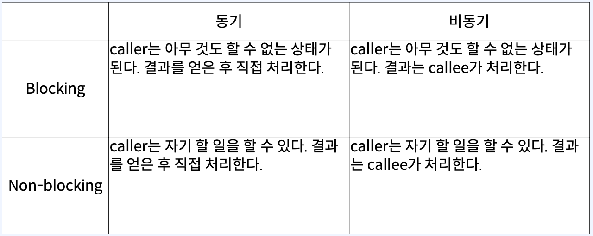

# 1. 함수 호출 관점에서 동기와 비동기

## 용어정리
`Caller`와 `Callee` 함수가 다른 함수를 호출하는 상황   
• Caller: 호출하는 함수  
• Callee: 호출 당하는 함수


## 함수형 인터페이스
1. 함수형 프로그래밍을 지원하기 위해 java 8부터 도입
2. 1개의 추상 메서드를 갖고 있는 인터페이스 
3. 함수를 1급 객체로 사용할 수 있다 - 함수를 변수에 할당하거나 인자로 전달하고 반환값으로 사용 가능 
4. Function, Consumer, Supplier, Runnable 등 
5. 함수형 인터페이스를 구현한 익명 클래스를 람다식으로 변경 가능 
6. 함수형 인터페이스는 호출한 쓰레드에서 실행된다


## A 모델  

```java
 @Slf4j
public class A {

    public static void main(String[] args) {
        log.info("Start main");
        var result = getResult();
        var nextValue = result + 1;
        assert nextValue == 1;
        log.info("Finish main");
    }

    public static int getResult() {
        log.info("Start getResult");
        try {
            Thread.sleep(1000);
        } catch (InterruptedException e) {
            throw new RuntimeException(e);
        }
        var result = 0;
        try {
            return result;
        } finally {
            log.info("Finish getResult");
        }
    }
}
```  
  


## B 모델
```java
@Slf4j
public class B {

    public static void main(String[] args) {
        log.info("Start main");
        getResult(new Consumer<Integer>() {
            @Override
            public void accept(Integer integer) {
                var nextValue = integer + 1;
                assert nextValue == 1;
            }
        });
        log.info("Finish main");
    }

    public static void getResult(Consumer<Integer> cb) {
        log.info("Start getResult");
        try {
            Thread.sleep(1000);
        } catch (InterruptedException e) {
            throw new RuntimeException(e);
        }
        var result = 0;
        cb.accept(result);
        log.info("Finish getResult");
    }
}
```  


## 두 모델 차이점
####  A 모델  
• main는 getResult의 결과에 관심이 있다  
• main은 결과를 이용해서 다음 코드를 실행한다  

#### B 모델  
• main은 getResult의 결과에 관심이 없다  
• getResult는 결과를 이용해서 함수형 인터페이스를 실행한다.


#### 동기  
• caller는 callee의 결과에 관심이 있다  
• caller는 결과를 이용해서 action을 수행한다  

#### 비동기  
• caller는 callee의 결과에 관심이 없다  
• callee는 결과를 이용해서 callback을 수행한다  


# 2. 함수 호출 관점에서 Blocking과 Non-blocking

## C 모델
```java
public static void main(String[] args) {
    log.info("Start main");
    var result = getResult();
    var nextValue = result + 1;
    assert nextValue == 1;
    log.info("Finish main");
}

//22:47:30.075 [main] INFO -- Start main
//22:47:30.077 [main] INFO -- Start getResult
//22:47:31.081 [main] INFO -- Finish getResult
//22:47:31.082 [main] INFO -- Finish main
```


## D 모델
```java

public static void main(String[] args) {
    log.info("Start main");
    getResult(new Consumer<Integer>() {
        @Override
        public void accept(Integer
                                   integer) {
            var nextValue = integer + 1;
            assert nextValue == 1;
        }
    });
    log.info("Finish main");
}


public static void getResult(Consumer<Integer> callback) {
    var executor = Executors.newSingleThreadExecutor();
    try {
        executor.submit(new Runnable() {
            @Override
            public void run() {
                log.info("Start getResult");
                try {
                    Thread.sleep(1000);
                } catch (InterruptedException e) {
                    e.printStackTrace();
                }
                var result = 0;
                try {
                    callback.accept(result);
                } finally {
                    log.info("Finish getResult");
                }
            }
        });
    } finally {
        executor.shutdown();
    }
}


//[main] INFO -- Start main
//[pool-1-thread-1] INFO -- Start getResult
//[main] INFO -- Finish main
//[pool-1-thread-1] INFO - - Finish getResult
```  


## 두 모델 차이점
#### C 모델(블로킹)
- callee를 호출한 후, callee가 완료되기 전까지 caller가 아무것도 할 수 없다
- 제어권을 callee가 가지고 있다

#### D 모델(논블로킹)
- caller는 callee를 기다리지 않고 본인의 일을 한다
- 제어권을 caller가 가지고 있다
- caller와 다른 별도의 thread가 필요하다


# 함수 호출 관점에서 동기와 비동기, Blocking과 Non-blocking  



# I/O 관점에서 Blocking/Non-blocking
## Blocking의 종류 -  blocking은 thread가 오랜 시간 일을 하거나 대기하는 경우 발생
- CPU-bound blocking: 오랜 시간 일을 한다
- IO-bound blocking: 오랜 시간 대기한다


## CPU-bound blocking
- thread가 대부분의 시간 CPU 점유
- 연산이 많은 경우
- 추가적인 코어를 투입  


## IO-bound blocking

- thread가 대부분의 시간을 대기
- 파일 읽기/쓰기, network 요청처리, 요청 전달 등
- IO-bound non-blocking 가능하다  


## Blocking의 전파
- 하나의 함수에서 여러 함수를 호출하기도 하고, 함수 호출은 중첩적으로 발생
- callee는 caller가 되고 다시 다른 callee를 호출
- blocking한 함수를 하나라도 호출한다면 caller는 blocking이 된다
- 함수가 non-blocking하려면 모든 함수가 non-blocking이어야 한다
- 따라서 I/O bound blocking 또한 발생하면 안된다


## I/O 모델


